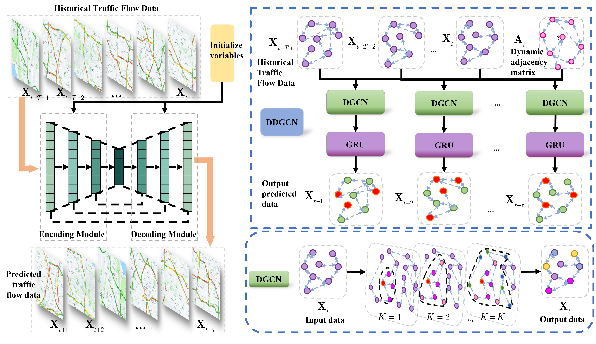
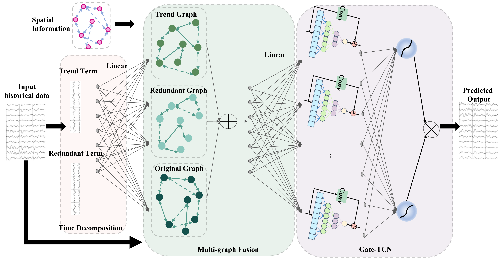

# Master-thesis
This is my master thesis, including two different topics. The original version is written by Chinese, I would provide the English abstract and some of detail of My thesis.

## Deep Spatial-Temporal Consistent Representation Learning for Time Series Prediction

The thesis focuses on a research about spatio-temporal data analyze and its applications. Here is the abstract of the thesis.

| **Abstract** |
|----|
| Currently, spatio-temporal data analysis has become a research hotspot in the field of data mining, attracting widespread attention at home and abroad. Meanwhile, spatio-temporal data analysis has been applied in many fields, such as traffic management, crime analysis, disease surveillance, environmental monitoring, wind power prediction and medical health. However, because spatio-temporal data are usually highly dependent, heterogeneous and periodic in time and space, it is difficult for existing algorithms to effectively and accurately accomplish the task of spatio-temporal data prediction, and most algorithms do not consider the specificity of spatiotemporal long- and short-term predictions. In order to solve the above problems and highlight the characteristics of analyzing long-term and short-term temporal data, this thesis carries out research work on spatio-temporal data analysis algorithms based on deep learning models in two different spatio-temporal data application scenarios, and the main contents and innovations of this thesis include. |
| 1) This thesis designs a **wind power forecasting** algorithm based on multi-graph fusion trends, in order to better fit the spatio-temporal correlation in long-term forecasting. Firstly, in order to better capture the periodic pattern of spatio-temporal data, the model performs trend decomposition of the original data in time series into trend terms and redundant terms, while it is believed that the decomposition of the original data will cause part of the information to be lost, and then the original information graph is introduced in order to better retain the original information of the data; secondly, considering the problem of implicit feature representation of nodes in the sequence, so the node embedding matrix is introduced to enhance the modeling ability of potential information. Finally, the above method has constructed the spatial and local time information of nodes’ features, and then from the global time features, the use of gated temporal convolutional network for global feature extraction and then obtain the wind power data for a certain period of time in the future. Experiments show that the proposed algorithm significantly outperforms other traditional and deep learning methods on the SDWPF dataset, and the effectiveness of the model developed in this paper is demonstrated by visualization analysis and ablation experiments on the model.  |
| 2) **Traffic flow prediction** is an important part of the intelligent transportation system, and its prediction accuracy is of great significance to the development of the traffic control system. In order to obtain accurate traffic flow prediction results, this thesis proposes a traffic flow prediction algorithm based on dynamic diffusion graph convolution to better simulate complex spatiotemporal dependencies. From the perspective of spatial dependence, considering the diffusion characteristics reflected in the modeling of the spatial dependence of the road network, the diffusion graph convolution model is used to learn the spatial characteristics between different nodes; The data set contains many potential factors, so in order to ensure that the features of each node between different moments are learned, the model introduces a dynamic adjacency matrix to further improve the model's sensitivity to time; from the perspective of time domain dependence, the use of Gated Recurrent Unit is used to extract the temporal features in the traffic flow data; the residual connection between the model layers is finally used to transfer more original information and improve the stability of the model. On the four public sub-data sets of PeMS, the model in this paper can obtain the prediction results of future traffic flow information based on the historical traffic flow information, and the overall prediction accuracy is high; at the same time, ablation experiments and parameter experiments also prove the proposed model. effectiveness. |
| KEY WORDS：Spatio-temporal data, Wind power forecasting, Traffic flow forecasting, Graph convolutional networks, Time-series modeling. |

## Framework 
###  
Traffic flow prediction

###  
Wind power forecasting

